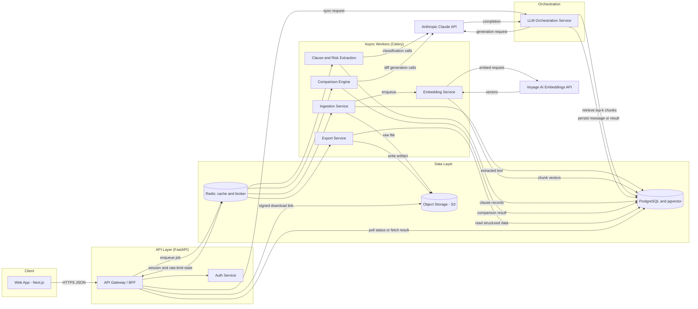
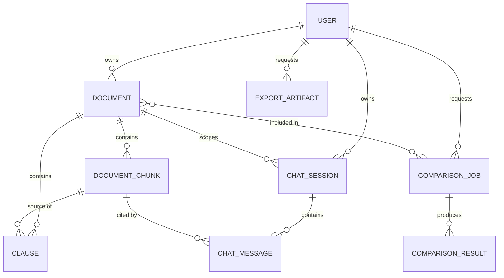

# Architecture — LegalLens

> Governs: system structure, boundaries, storage model, invariants.
> Source: bootstrapped from `docs/implementation.md` v1.0.
> Depends on: `project-overview.md`.

## 1. Components

| # | Component | Responsibility |
|---|---|---|
| 1 | Web Client (Next.js) | Upload UI, chat interface, comparison view, export controls |
| 2 | API Gateway / BFF (FastAPI) | AuthN/AuthZ enforcement, request validation, routing, rate limiting |
| 3 | Auth Service | Registration, login, token issuance and refresh |
| 4 | Ingestion Service | File validation, malware scan, text extraction, OCR fallback, chunking |
| 5 | Embedding Service | Generates chunk-level vector embeddings via Voyage AI, writes to pgvector |
| 6 | LLM Orchestration Service | Prompt construction, retrieval-augmented generation, calls to Claude, citation mapping |
| 7 | Clause & Risk Extraction Service | Hybrid rule-based + LLM clause tagging and risk scoring |
| 8 | Comparison Engine | Clause-level alignment and diffing across document sets |
| 9 | Export Service | Renders summary / checklist / lawyer-brief artifacts to PDF, DOCX, or Markdown |
| 10 | Job Queue (Celery + Redis) | Asynchronous execution of ingestion, embedding, extraction, comparison, export |
| 11 | Data Layer | PostgreSQL + pgvector, S3-compatible object storage, Redis cache |
| 12 | Audit & Observability | Structured logging, immutable audit trail, metrics, tracing, error monitoring |
| 13 | External — Generation | Anthropic Claude API |
| 14 | External — Embeddings | Voyage AI API |

## 2. Architecture Diagram



## 3. Data Flow (invariants — do not violate without updating this file)

1. **Upload (sync).** `POST /documents` — gateway authenticates, validates MIME
   type/size, computes SHA-256 for dedup, stores raw file in S3, creates
   `Document` row (`status = uploaded`), enqueues ingestion, returns `202`.
2. **Ingestion (async).** Worker extracts text (PyMuPDF for PDF, python-docx
   for DOCX), OCR fallback (Tesseract) for pages with no text layer. Chunks
   text (~500 tokens, 50-token overlap) into `document_chunks`. `status`
   moves `processing` → `ready`/`failed`; `processing_stage` tracks
   `extracting_text → ocr → chunking → embedding`.
3. **Embedding (async, chained).** Each chunk sent to Voyage AI; vector
   written to `document_chunks.embedding` (pgvector).
4. **Feature request.** Only once `Document.status = ready` may the client
   request simplification, clause extraction, comparison, or chat.
5. **Retrieval.** Chat retrieves top-k chunks by cosine similarity. Full-doc
   simplification uses map-reduce (per-chunk simplify, then coherence pass).
6. **Generation.** Orchestration service embeds retrieved chunks + an
   explicit citation requirement + the "informational, not legal advice"
   system directive into the prompt, calls Claude (streaming for chat/
   simplification), maps cited claims back to `chunk_id`/`page_number`.
7. **Persistence and response.** Results persisted (`chat_messages`,
   `clauses`, or the relevant result table); citation metadata returned for
   source highlighting.
8. **Comparison (async).** `POST /comparisons` with 2–5 `document_ids`.
   Engine aligns clauses by `clause_type` (using prior clause-extraction
   output), calls Claude for a diff summary + materiality rating per aligned
   group.
9. **Export (async).** `POST /documents/{id}/export` assembles the artifact
   from already-persisted structured data — **does not re-call the LLM**
   when cached data is sufficient — renders to the requested format, uploads
   to S3, returns a signed, time-limited URL.
10. **Audit.** Every state-changing action (upload, export, delete, every LLM
    call) writes an `audit_logs` row: actor, action, resource, timestamp, IP.

## 4. Tech Stack

| Layer | Technology | Rationale |
|---|---|---|
| Frontend framework | Next.js 14+ (React 18+, TypeScript), App Router | File-based routing for the four primary views; TS enforces shapes matching backend Pydantic schemas |
| Frontend styling | Tailwind CSS | Utility-first for the many small conditional risk/diff styles |
| Frontend server-state | TanStack Query | UI is dominated by server-owned async state (job polling, chat history, comparison results) |
| Backend framework | Python 3.11+, FastAPI | Async-native for I/O-bound LLM/embedding calls; Pydantic validation; auto OpenAPI |
| Background jobs | Celery + Redis broker | Ingestion/OCR/embedding/comparison/export are long-running and must not block request/response |
| Relational database | PostgreSQL 15+ | ACID guarantees; JSONB for flexible metadata (e.g. chat citations) |
| Vector store | pgvector on the same Postgres instance | Avoids a second DB engine at this scale; keeps relational + vector data transactionally consistent |
| Object storage | S3-compatible (AWS S3 prod, MinIO local) | Durable, cheap, supports SSE-at-rest and signed URLs |
| Cache / rate limiting | Redis | Session blocklists, rate-limit counters, Celery broker share one instance |
| Document parsing | PyMuPDF (PDF), python-docx (DOCX) | Mature, no per-call cost |
| OCR | Tesseract OCR | Open-source, self-hostable fallback for scanned pages |
| LLM — generation | Anthropic Claude API, `claude-sonnet-5` | Simplification, comparison diffs, Q&A synthesis — quality + long-context matter most |
| LLM — classification | Anthropic Claude API, `claude-haiku-4-5-20251001` | High-volume, low-complexity per-chunk clause pre-filtering |
| Embeddings | Voyage AI API, `voyage-context-4` | Anthropic recommends Voyage for embeddings; contextualized chunk embeddings suit clauses whose meaning depends on surrounding contract context |
| Auth | JWT (access + refresh), argon2id hashing | Stateless verification scales horizontally |
| Containerization | Docker, Docker Compose (local); ECS Fargate or Kubernetes (prod) | Portability; Fargate avoids node management |
| CI/CD | GitHub Actions | Tight source integration |
| Monitoring | Prometheus + Grafana, Sentry, structured JSON logs | LLM pipelines fail in hard-to-reproduce ways; need telemetry-driven debugging |

**Note:** `claude-sonnet-5` and `claude-haiku-4-5-20251001` are the model IDs
named in the source specification — verify against current available models
before wiring the LLM Orchestration Service (Section 5.4 below), since model
availability can change.

## 5. Directory & File Structure

```
legallens/
├── context/                          # this directory — source of truth
├── apps/
│   ├── web/                          # Next.js frontend
│   │   ├── src/
│   │   │   ├── app/                  # App Router pages (upload, document/[id], compare, chat)
│   │   │   ├── components/           # Reusable UI: DiffView, RiskBadge, ClauseCard, ChatPane
│   │   │   ├── hooks/                # useDocumentStatus, useChatSession, useComparison
│   │   │   ├── lib/                  # api client, auth token handling, formatting helpers
│   │   │   ├── styles/               # Tailwind config and global styles
│   │   │   └── types/                # TypeScript types mirrored from backend Pydantic schemas
│   │   ├── public/
│   │   ├── package.json
│   │   └── next.config.js
│   └── api/                          # FastAPI backend
│       ├── app/
│       │   ├── main.py               # FastAPI app instantiation, middleware registration
│       │   ├── core/                 # config.py (Pydantic Settings), security.py, logging.py
│       │   ├── api/v1/               # route modules: auth.py, documents.py, comparisons.py, chat.py, exports.py
│       │   ├── services/             # business logic: ingestion.py, embedding.py, llm_orchestration.py,
│       │   │                         #   clause_extraction.py, comparison.py, export.py, audit.py
│       │   ├── models/               # SQLAlchemy ORM models, one file per aggregate (user.py, document.py, ...)
│       │   ├── schemas/              # Pydantic request/response schemas, mirrors models/ 1:1 where applicable
│       │   ├── workers/              # Celery task definitions, one file per async job type
│       │   ├── prompts/              # versioned prompt templates (simplify.md, extract_clauses.md, compare.md, chat.md)
│       │   └── db/                   # session.py, base.py
│       ├── tests/
│       │   ├── unit/
│       │   ├── integration/
│       │   └── eval/                 # LLM-quality golden-dataset evaluation harness
│       ├── alembic/                  # database migrations
│       ├── requirements.txt
│       └── Dockerfile
├── infra/
│   ├── docker-compose.yml            # local dev: api, web, postgres+pgvector, redis, minio
│   └── k8s/                          # production manifests (post-MVP)
├── docs/
│   └── implementation.md             # original master spec
├── .github/workflows/                # ci.yml (lint, test), deploy.yml
├── .env.example
└── README.md
```

## 6. Core Modules

Each module is a Python package under `apps/api/app/services/`, exposed via
`apps/api/app/api/v1/`.

| Module | Responsibility | Key interface |
|---|---|---|
| 6.1 Auth | Registration, login, token issuance/refresh, password hashing | `register_user()`, `authenticate_user()`, `refresh_access_token()` |
| 6.2 Document Ingestion | Validate uploads, store raw bytes, extract text, OCR, chunk | `create_document()`, `process_document()` (Celery entry) |
| 6.3 Embedding & Retrieval | Generate chunk embeddings via Voyage AI, similarity search | `embed_chunks()`, `retrieve_relevant_chunks()` |
| 6.4 LLM Orchestration | Construct grounded prompts, call Claude, parse/validate citations | `generate_grounded_response()` |
| 6.5 Clause & Risk Extraction | Identify clause spans, classify into 10 types, assign risk + rationale | `extract_clauses()` |
| 6.6 Comparison Engine | Align clauses across 2–5 docs, diff summary + materiality rating | `create_comparison()`, `run_comparison()` (Celery entry) |
| 6.7 Conversational Q&A | Chat session/history lifecycle, delegates generation to 6.4 | `start_chat_session()`, `ask_question()` |
| 6.8 Export & Output | Assemble summary/checklist/lawyer-brief from persisted data, render to file | `generate_export()` |
| 6.9 Audit & Compliance Logging | Record every state-changing action + every LLM call (append-only) | `record_audit_event()` |
| 6.10 Async Job Coordination | Enqueue/track Celery task state, expose status for polling | `enqueue_job()`, `get_job_status()` |

Full function signatures:

```python
# services/ingestion.py
async def create_document(owner_id: UUID, file: UploadFile) -> Document: ...
async def process_document(document_id: UUID) -> None: ...

# services/embedding.py
async def embed_chunks(document_id: UUID) -> None: ...
async def retrieve_relevant_chunks(document_id: UUID, query: str, top_k: int = 8) -> list[DocumentChunk]: ...

# services/llm_orchestration.py
async def generate_grounded_response(
    task: Literal["simplify", "chat", "extract_clauses", "compare"],
    context_chunks: list[DocumentChunk],
    user_input: str,
    reading_level: str | None = None,
) -> GroundedResponse: ...

# services/clause_extraction.py
async def extract_clauses(document_id: UUID) -> list[Clause]: ...
# Implementation note: a regex/keyword pre-filter (e.g. "terminate", "indemnify",
# "auto-renew") narrows candidate chunks per clause type before the LLM
# classification call, reducing claude-haiku-4-5-20251001 calls per document.

# services/comparison.py
async def create_comparison(owner_id: UUID, document_ids: list[UUID]) -> ComparisonJob: ...
async def run_comparison(comparison_job_id: UUID) -> None: ...

# services/chat.py
async def start_chat_session(document_id: UUID, owner_id: UUID) -> ChatSession: ...
async def ask_question(document_id: UUID, session_id: UUID, question: str) -> ChatMessage: ...

# services/export.py
async def generate_export(
    owner_id: UUID,
    export_type: Literal["summary", "checklist", "lawyer_brief", "comparison_report"],
    file_format: Literal["pdf", "docx", "md"],
    document_id: UUID | None = None,
    comparison_job_id: UUID | None = None,
) -> ExportArtifact: ...

# services/audit.py
async def record_audit_event(
    actor_id: UUID | None, action: str, resource_type: str, resource_id: UUID,
    metadata: dict, ip_address: str,
) -> None: ...

# job coordination (workers/)
def enqueue_job(job_type: str, payload: dict) -> str: ...   # returns Celery task id
def get_job_status(task_id: str) -> JobStatus: ...
```

## 7. Data Models

### 7.1 Entity-Relationship Diagram



### 7.2 Schema Definitions (storage invariants — Postgres)

**`users`**: `id` UUID PK · `email` unique NOT NULL · `password_hash` NOT NULL
(argon2id) · `full_name` NOT NULL · `role` enum(`user`,`admin`) default `user`
· `is_active` boolean default `true` · `created_at`/`updated_at`.

**`documents`**: `id` UUID PK · `owner_id` FK→users · `original_filename` ·
`mime_type` (one of the 3 supported types) · `file_size_bytes` ≤ 20,971,520 ·
`storage_key` (S3 key) · `file_hash_sha256` char(64) indexed (per-user dedup)
· `status` enum(`uploaded`,`processing`,`ready`,`failed`) default `uploaded`
· `processing_stage` enum(`extracting_text`,`ocr`,`chunking`,`embedding`)
nullable · `page_count` nullable · `language` BCP-47 nullable ·
`failure_reason` nullable · `created_at`/`updated_at`.

**`document_chunks`**: `id` PK · `document_id` FK · `chunk_index` int, unique
per document · `page_number` nullable · `text` ≤ 500 tokens target (700 hard
cap, split at sentence boundary) · `token_count` · `embedding` vector(1024),
nullable until embedding step completes (dimension pinned to the Voyage
model at integration time) · `created_at`.

**`clauses`**: `id` PK · `document_id` FK · `source_chunk_id` FK nullable ·
`clause_type` enum (below) · `text_excerpt` · `start_offset`/`end_offset`
(end > start, both within chunk bounds) · `risk_level`
enum(`low`,`medium`,`high`) · `risk_rationale` (1–2 sentences) · `created_at`.
`clause_type` values: `indemnification`, `termination`,
`limitation_of_liability`, `confidentiality`, `non_compete`,
`arbitration_dispute_resolution`, `payment_terms`, `auto_renewal`,
`governing_law`, `other`.

**`comparison_jobs`**: `id` PK · `owner_id` FK · `status`
enum(`queued`,`running`,`completed`,`failed`) default `queued` ·
`created_at`/`completed_at` (nullable until terminal).

**`comparison_job_documents`** (join, composite PK
`comparison_job_id`+`document_id`): 2 ≤ rows per job ≤ 5, enforced at the
service layer on job creation.

**`comparison_results`**: `id` PK · `comparison_job_id` FK · `clause_type` ·
`excerpts_by_document` jsonb `{document_id: excerpt_text}` · `diff_summary`
· `materiality` enum(`none`,`minor`,`significant`,`critical`) · `created_at`.

**`chat_sessions`**: `id` PK · `document_id` FK · `owner_id` FK ·
`created_at`/`last_message_at`.

**`chat_messages`**: `id` PK · `session_id` FK · `role`
enum(`user`,`assistant`) · `content` · `citations` jsonb default `[]`
(`{chunk_id, page_number, excerpt}[]`; required non-empty when
`role=assistant` and the answer makes a factual claim) · `created_at`.

**`export_artifacts`**: `id` PK · `owner_id` FK · `document_id` FK nullable
· `comparison_job_id` FK nullable (exactly one of these two non-null) ·
`export_type` enum(`summary`,`checklist`,`lawyer_brief`,`comparison_report`)
· `file_format` enum(`pdf`,`docx`,`md`) · `status`
enum(`queued`,`generating`,`ready`,`failed`) default `queued` ·
`storage_key` nullable until `ready` · `created_at`.

**`audit_logs`** (append-only — **no UPDATE/DELETE grants at the DB role
level**): `id` PK · `actor_id` FK nullable (system actions) · `action`
(e.g. `document.upload`, `document.export`, `document.delete`, `llm.call`) ·
`resource_type` · `resource_id` · `metadata` jsonb default `{}` ·
`ip_address` inet · `created_at`.

### 7.3 Validation Rules

- Uploads validated by magic-byte inspection, **not** file extension;
  rejected outside the 3 supported types; rejected > 20 MB; rejected (return
  existing `Document` instead of reprocessing) if `file_hash_sha256` already
  exists for the same owner.
- `document_chunks.text`: hard cap 700 tokens; split at nearest sentence
  boundary.
- `clauses.end_offset` strictly > `start_offset`, both within the chunk's
  `text` bounds.
- `chat_messages.citations`: an assistant message making any claim about
  document content must have ≥ 1 citation; zero-citation is only valid for a
  clarifying question or an explicit "insufficient information" response.
- `comparison_job_documents`: rejected at creation with < 2 or > 5
  `document_id`s, or if any referenced document has `status != ready`.
- Monetary/date values in `clauses.text_excerpt` are stored as original
  source text, never parsed/normalized — normalization is a
  presentation-layer concern only.

## 8. API Contracts

All endpoints under `/api/v1`, require `Authorization: Bearer <access_token>`
unless noted, return `application/json` except export downloads.

| Method | Path | Purpose | Success | Key errors |
|---|---|---|---|---|
| POST | `/auth/register` | Create a user account | 201 | 400, 409 email exists |
| POST | `/auth/login` | Exchange credentials for tokens | 200 | 401 |
| POST | `/auth/refresh` | Exchange refresh token for access token | 200 | 401 |
| POST | `/documents` | Upload a document | 202 | 400, 413 |
| GET | `/documents/{document_id}` | Fetch document metadata | 200 | 404, 403 |
| GET | `/documents/{document_id}/status` | Poll ingestion status | 200 | 404 |
| DELETE | `/documents/{document_id}` | Hard-delete document + derived data | 204 | 404, 403 |
| POST | `/documents/{document_id}/simplify` | Plain-language simplification | 200 streamed | 409, 502 |
| POST | `/documents/{document_id}/extract-clauses` | Run clause/risk extraction | 202 | 409 |
| GET | `/documents/{document_id}/clauses` | List extracted clauses | 200 | 404 |
| POST | `/comparisons` | Start a comparison job | 202 | 400 |
| GET | `/comparisons/{comparison_job_id}` | Fetch comparison status/results | 200 | 404, 403 |
| POST | `/documents/{document_id}/chat/sessions` | Start a chat session | 201 | 409 |
| POST | `/documents/{document_id}/chat/sessions/{session_id}/messages` | Ask a question | 200 streamed | 409, 502 |
| GET | `/documents/{document_id}/chat/sessions/{session_id}/messages` | Fetch chat history | 200 | 404 |
| POST | `/exports` | Request an export artifact | 202 | 400, 409 |
| GET | `/exports/{export_id}` | Fetch export status / signed URL | 200 | 404, 403 |

Selected schemas (see `docs/implementation.md` Section 7.2 for the full set
if this excerpt is insufficient during implementation):

```jsonc
// POST /documents/{id}/simplify — request
{ "reading_level": "elementary | plain_english | detailed", // default plain_english
  "scope": "full_document | {\"clause_id\": \"uuid\"}" }

// POST /documents/{id}/simplify — response (final SSE event)
{ "simplified_text": "string",
  "citations": [{"chunk_id": "uuid", "page_number": 3, "excerpt": "string"}],
  "disclaimer": "This is general information, not legal advice." }

// POST /comparisons — request
{ "document_ids": ["uuid", "uuid"] } // 2..5, all owned + status=ready

// GET /comparisons/{id} — response
{ "comparison_job_id": "uuid", "status": "completed",
  "results": [{"clause_type": "termination",
    "excerpts_by_document": {"uuid-a": "string", "uuid-b": "string"},
    "diff_summary": "string", "materiality": "significant"}] }

// POST /exports — request (exactly one of document_id / comparison_job_id)
{ "export_type": "summary|checklist|lawyer_brief|comparison_report",
  "file_format": "pdf|docx|md", "document_id": "uuid" }
```

## 9. Configuration & Environment

| Variable | Required | Notes |
|---|---|---|
| `ENVIRONMENT` | Yes | `development` \| `staging` \| `production` |
| `DATABASE_URL` | Yes | pgvector-enabled Postgres, `postgresql+asyncpg://...` |
| `REDIS_URL` | Yes | Shared by cache + rate limiter |
| `CELERY_BROKER_URL` | Yes | Separate Redis DB index from cache |
| `S3_BUCKET` | Yes | |
| `S3_ENDPOINT_URL` | Local dev only | Points at MinIO locally; omitted in prod |
| `S3_ACCESS_KEY_ID` / `S3_SECRET_ACCESS_KEY` | Yes | Secrets manager in prod, never committed |
| `ANTHROPIC_API_KEY` | Yes | Secrets manager in prod |
| `VOYAGE_API_KEY` | Yes | Secrets manager in prod |
| `JWT_SECRET` | Yes | 256-bit random, rotated on schedule |
| `JWT_ALGORITHM` | Yes | `HS256` |
| `ACCESS_TOKEN_EXPIRE_MINUTES` | Yes | `15` |
| `REFRESH_TOKEN_EXPIRE_DAYS` | Yes | `14` |
| `MAX_UPLOAD_SIZE_MB` | Yes | `20`, enforced at proxy + app layer |
| `ALLOWED_MIME_TYPES` | Yes | pdf, docx, txt |
| `CORS_ORIGINS` | Yes | Comma-separated allow-list, never `*` in prod |
| `RATE_LIMIT_PER_MINUTE` | Yes | `30`, per-user on LLM-calling endpoints |
| `SENTRY_DSN` | Production only | |
| `LOG_LEVEL` | Yes | `INFO`; `DEBUG` dev only |

`.env` is local-dev only, gitignored. `.env.example` documents every
variable. Config loads through one Pydantic `BaseSettings` class so a
missing required variable fails startup immediately.

## 10. Performance Targets & Known Bottlenecks

- Documents up to 100 pages (~50,000 tokens) via hierarchical chunking +
  map-reduce, not a single-pass prompt.
- p95 API latency ≤ 2 s for non-LLM endpoints; ≤ 15 s simplification (≤20pp
  doc); ≤ 5 s per chat turn.
- Stateless API/worker processes scale horizontally (CPU for API, queue
  depth for Celery).
- Known bottlenecks and mitigations: LLM generation latency → map-reduce +
  streaming; OCR → only run on pages with no text layer, isolated Celery
  queue; embedding → batch to largest supported request size; synchronous
  upload blocking → upload endpoint only validates/stores, all processing
  deferred to the job queue; DB connection exhaustion → connection pooling
  (PgBouncer / SQLAlchemy pool tuning).
